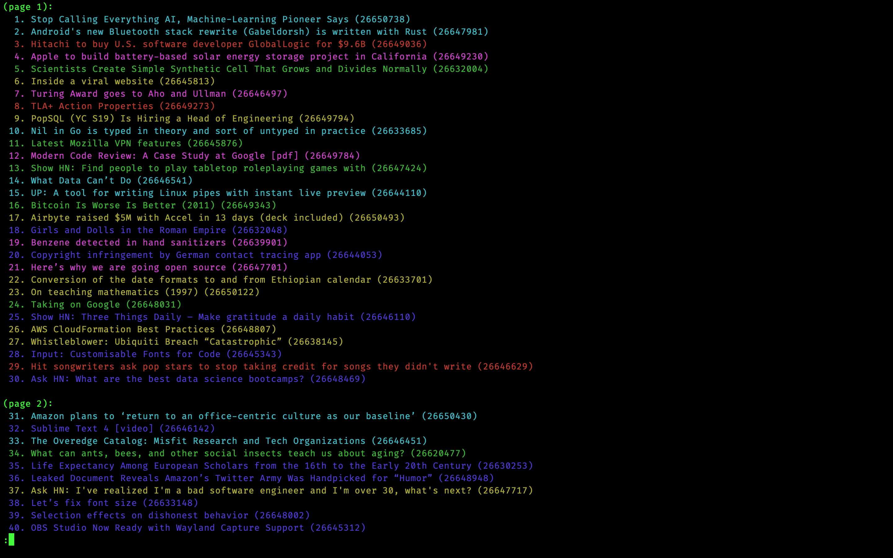

# Description

This is a CLI-based reader for [Hacker News](https://news.ycombinator.com/)! `rich-hn` will use the `curses` library (and potentially some capabilities from the [`rich`](https://github.com/willmcgugan/rich) Python library) to format Hacker News in a beautiful way.

Currently, an MVP version of the application is available, and details on how to run it can be found below. The MVP version of the app uses [`less`](https://man7.org/linux/man-pages/man1/less.1.html) with the `-R` flag as a backend for convenience. 

## Examples

### News View


### Live Action Demo
[)](https://www.youtube.com/watch?v=TYElDtGCVlo)

# Prerequisites

- Python 3.7+
- [Pipenv](https://pipenv.pypa.io/en/latest/), which can be installed by running `pip install --user pipenv`.

# Running the App

## MVP
1. Clone the project repo and `cd` into it:
```bash
git clone https://github.com/zaataylor/rich-hn
cd rich-hn
```
2. Install the required dependencies and activate a virtual environment by running the following:
```bash
pipenv install
pipenv shell
```
3. Run `python mvp.py` to start the application
4. Have fun! :)
5. When you're finished playing with things and want to deactivate the shell created by `pipenv`, run the command `exit`.

## Final Version
- Not Implemented Yet

# Feature Roadmap

Here's a quick summary of `rich-hn`'s feature roadmap:

Implementation Status Symbols
| Symbol     | Description             |
|------------|-------------------------|
| **&check;**| **Done**                |
| **_WIP_**  | **Work In Progress**    |
| **_NYI_**  | **Not Yet Implemented** |


- [**_NYI_**] Vim standard keybindings (`h`, `j`, `k`, `l`) for scrolling up and down, and navigating forward and backward through pages.
- [**_NYI_**] Up and down arrow keys for scrolling up and down, and navigating to forward and backward through pages using the left and right arrow keys.
- [**_NYI_**] Make the keybindings for scrolling and navigating customizable
- [**_NYI_**] Different colors for `Ask HN`, `Show HN`, `stories`, and `jobs` posts.
- [**_NYI_**] Manual updating of a page's contents using a specific keybinding.
- [**_WIP_**] `more`/`vim` style scrolling UI.
- [**_WIP_**] Display posts in a table or list/tree style.

# Known Issues
Feel free to make issues related to problems you see when using the application. This will help me make it better! Here are some currently known problems:
- For highly nested comments, text begins to wrap around to the other side of the terminal.
- If italicized text is split over two or more paragraphs using only one italic block marker (i.e. the beginning of the first paragraph starts with the italic delimeter, and the end of the n-th paragraph ends with the italic delimeter), the italics for the second paragraph won't be rendered properly
- Accented characters (e.g. é, ā, à, etc.) will currently break URL highlighting 
